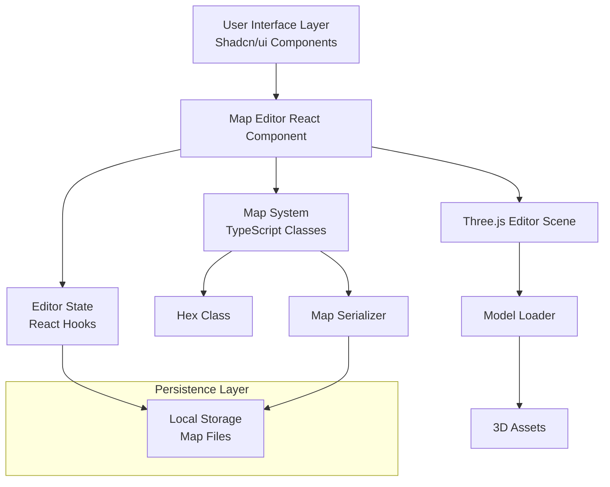

# Системные Паттерны

## Архитектура

### Высокоуровневая Диаграмма



### Архитектура Редактора

Проект построен на современном стеке:
- **Next.js 16**: React фреймворк с App Router
- **React 19**: UI библиотека с хуками
- **Three.js**: 3D рендеринг
- **TypeScript**: Типизация всех компонентов

## Ключевые Технические Решения

### Паттерн 1: Component-Based Architecture

**Описание**: Разделение UI на переиспользуемые React компоненты

**Как использовать**:
- **Компоненты**: `MapEditor`, `ModelPreview`, UI компоненты из `components/ui/`
- **Хуки**: Использование React хуков для состояния (`useState`, `useRef`, `useEffect`)
- **Refs**: Использование `useRef` для доступа к Three.js объектам

**Пример**:
```typescript
const MapEditor = () => {
  const canvasRef = useRef<HTMLCanvasElement>(null)
  const sceneRef = useRef<THREE.Scene | null>(null)
  const mapRef = useRef<GameMap | null>(null)

  useEffect(() => {
    // Инициализация Three.js сцены
  }, [])

  return <canvas ref={canvasRef} />
}
```

### Паттерн 2: Ref Pattern для Three.js

**Описание**: Использование `useRef` для хранения Three.js объектов вне React дерева

**Как использовать**: Three.js объекты (сцены, камеры, меши) хранятся в refs, чтобы избежать ререндеров React

**Пример**:
```typescript
const sceneRef = useRef<THREE.Scene | null>(null)
const hexMeshesRef = useRef<Map<string, THREE.Mesh>>(new Map())

// Создание меша
const mesh = new THREE.Mesh(geometry, material)
hexMeshesRef.current.set(key, mesh)
sceneRef.current?.add(mesh)
```

### Паттерн 3: Command Pattern для Undo/Redo

**Описание**: История состояний для отмены и повтора операций

**Реализация**: `historyRef` содержит массив состояний карты, `historyIndexRef` указывает на текущее состояние

**Пример**:
```typescript
const historyRef = useRef<HistoryState[]>([])
const historyIndexRef = useRef<number>(-1)

const saveHistoryState = () => {
  const mapJson = MapSerializer.serialize(mapRef.current, mapSize, {})
  historyRef.current.push({ map: mapJson, timestamp: Date.now() })
  historyIndexRef.current = historyRef.current.length - 1
}

const undo = async () => {
  if (historyIndexRef.current > 0) {
    historyIndexRef.current--
    const state = historyRef.current[historyIndexRef.current]
    const { map } = MapSerializer.deserialize(state.map)
    mapRef.current = map
    await buildMap()
  }
}
```

### Паттерн 4: Factory Pattern для Hex

**Описание**: Создание Hex объектов через конструктор с валидацией

**Реализация**: `Hex` класс создается с координатами (q, r) и типом местности

### Паттерн 5: File System Integration Pattern

**Описание**: Интеграция с системными диалогами файловой системы для улучшенного UX

**Реализация**:
- Использование File System Access API для современных браузеров
- Fallback на webkitdirectory для совместимости
- TypeScript декларации для расширения Window API

**Пример**:
```typescript
// Расширение Window для File System Access API
declare global {
  interface Window {
    showDirectoryPicker?: () => Promise<FileSystemDirectoryHandle>
  }
}

const handleFolderSelect = async () => {
  try {
    if (window.showDirectoryPicker) {
      const dirHandle = await window.showDirectoryPicker()
      setSelectedFolder(dirHandle.name)
    } else {
      // Fallback для старых браузеров
      const input = document.createElement('input')
      input.type = 'file'
      input.webkitdirectory = true
      input.click()
    }
  } catch (err: unknown) {
    if (err instanceof Error && err.name !== 'AbortError') {
      console.error('Error selecting folder:', err)
    }
  }
}
```

**Поддержка браузеров**:
- File System Access API: Chrome 86+, Edge 86+
- Fallback (webkitdirectory): Firefox, Safari и старые браузеры

### Паттерн 6: Modal Dialog Pattern для SaveMapDialog

**Описание**: Модальное окно для сохранения карт с системным диалогом выбора папки

**Реализация**:
- Компонент `SaveMapDialog` использует Shadcn/ui Dialog
- Интеграция с File System Access API для выбора папки
- Fallback на webkitdirectory для совместимости
- TypeScript интерфейс `SaveMapData` для типизации

**Как использовать**:
```typescript
interface SaveMapData {
  name: string        // Название карты
  description: string // Описание карты
  folder: string      // Выбранная папка или 'Downloads'
  filename: string    // Сгенерированное имя файла
}

const [saveDialogOpen, setSaveDialogOpen] = useState(false)

const handleSave = (saveData: SaveMapData) => {
  // Сохранение через MapSerializer
  const jsonString = MapSerializer.serialize(map, mapSize, {
    name: saveData.name,
    description: saveData.description
  })
  // Создание и скачивание файла
}

<SaveMapDialog
  open={saveDialogOpen}
  onOpenChange={setSaveDialogOpen}
  onSave={handleSave}
/>
```

**Особенности**:
- Системный диалог выбора папки через `window.showDirectoryPicker()`
- Graceful fallback для браузеров без поддержки File System Access API
- Автоматическая санитизация имени файла
- Валидация обязательных полей
- Горячие клавиши (Ctrl+Enter)

### Паттерн 7: Singleton Pattern для ModelLoader

**Описание**: Единственный экземпляр ModelLoader для кеширования моделей

**Реализация**: `modelLoader` экспортируется как singleton

## Стандарты Кода

### Именование

- **Компоненты**: PascalCase (`MapEditor`, `ModelPreview`)
- **Функции/методы**: camelCase (`buildMap`, `updateHexMesh`)
- **Константы**: UPPER_SNAKE_CASE (`TERRAIN_TYPES`, `LEVEL_HEIGHT`)
- **Интерфейсы**: PascalCase с префиксом `I` или без (`HexData`, `ClipboardData`)
- **Типы**: PascalCase (`TerrainType`, `EditMode`)
- **Файлы**: PascalCase для компонентов (`MapEditor.tsx`), camelCase для утилит (`modelLoader.ts`)

### Структура файлов

```
Medieval-Hexagon-Map-Editor/
├── app/                    # Next.js App Router
│   ├── layout.tsx         # Root layout
│   ├── page.tsx           # Главная страница
│   └── api/               # API routes
│       └── assets/        # Proxy для assets
├── components/            # React компоненты
│   ├── MapEditor.tsx      # Основной компонент редактора
│   └── ui/                # Shadcn/ui компоненты
│       ├── button.tsx
│       ├── card.tsx
│       └── ...
├── lib/                   # Утилиты и игровая логика
│   ├── game/              # Игровые классы
│   │   ├── Hex.ts
│   │   ├── Map.ts
│   │   ├── MapSerializer.ts
│   │   └── HexCoordinateConverter.ts
│   ├── three/             # Three.js утилиты
│   │   └── ModelLoader.ts
│   └── utils.ts           # Общие утилиты
├── assets/                # 3D модели и текстуры (симлинк)
├── public/                # Статические файлы
├── .memory_bank/          # Livedocs документация
├── docs/                  # Дополнительная документация
└── styles/                # Глобальные стили
```

### Обработка ошибок

**Принцип**: Fail gracefully с fallback значениями и пользовательскими уведомлениями

**Пример**:
```typescript
const loadModel = async (key: string) => {
  try {
    return await modelLoader.loadModel(key, objPath, mtlPath)
  } catch (error) {
    console.error(`Failed to load model ${key}:`, error)
    showNotification('error', `Не удалось загрузить модель: ${key}`)
    return null
  }
}
```

**Уведомления**: Использование `showNotification` для информирования пользователя об ошибках и успешных операциях

### Асинхронные операции

**Паттерн**: Использование `async/await` для всех асинхронных операций

**Пример**:
```typescript
const buildMap = async () => {
  const promises: Promise<void>[] = []
  mapRef.current.hexes.forEach((hexStack, key) => {
    hexStack.forEach(hex => {
      promises.push(createHexMesh(hex))
    })
  })
  await Promise.all(promises)
}
```

## Архитектурные Правила

### 1. Разделение ответственности

- **UI компоненты** (`components/`) не должны содержать игровую логику
- **Игровая логика** (`lib/game/`) не должна зависеть от UI или Three.js
- **Three.js утилиты** (`lib/three/`) не должны содержать игровую логику
- **MapEditor** координирует взаимодействие между UI, логикой и рендерингом

### 2. Использование Three.js

- Все 3D операции через Three.js API
- Модели кешируются в `ModelLoader` для повторного использования
- Меши хранятся в `hexMeshesRef` для быстрого доступа
- Использование `requestAnimationFrame` для рендеринга

### 3. Управление состоянием

- **Локальное состояние**: `useState` для UI состояния
- **Refs**: `useRef` для Three.js объектов и больших структур данных
- **Эффекты**: `useEffect` для синхронизации с Three.js и побочных эффектов

### 4. Стилизация

- Используем Shadcn/ui компоненты (`components/ui/`)
- Tailwind CSS для кастомной стилизации
- Темная тема по умолчанию
- Адаптивность через Tailwind utilities

### 5. Система Уровней Тайлов

**Описание**: Редактор поддерживает многоуровневую систему размещения тайлов (до 5 уровней, 0-4).

**Ключевые принципы**:
- **LEVEL_HEIGHT**: Константа, равная высоте базового тайла после масштабирования. Устанавливается один раз при первой загрузке тайла и используется для всех последующих вычислений
- **Позиционирование**: Каждый уровень размещается на верхней поверхности предыдущего уровня
- **Формула**: `Y_position = level * LEVEL_HEIGHT - minY`, где `minY` - нижняя точка модели после масштабирования
- **Уровень 0**: Нижняя часть тайла на уровне земли (Y = 0 - minY)
- **Уровень N**: Нижняя часть тайла на верхней поверхности уровня N-1 (Y = N * LEVEL_HEIGHT - minY)

**Структура данных**:
- `Map.hexes`: Map с ключами `"q,r"` и значениями `Hex[]` (стек тайлов)
- `Hex.height`: Число от 0 до 4, определяющее уровень тайла
- `selectedHexes`: `Array<{ q: number; r: number }>` - массив выделенных тайлов

**Как использовать**:
```typescript
// Получить верхний тайл в позиции
const topmostHex = map.getHex(q, r)

// Получить все тайлы в позиции (все уровни)
const hexStack = map.getHexStack(q, r)

// Разместить тайл на уровне
const hex = new Hex(q, r, terrain)
hex.height = targetLevel
map.setHex(q, r, hex)
```

### 6. Синхронизация Выделения Тайлов

**Описание**: Рамка выделения (`selectionMeshesRef`) должна синхронизироваться с позицией тайла при перемещении и изменении высоты.

**Проблема**: При асинхронном обновлении 3D мешей тайлов (`updateHexMesh`, `moveHex`, изменение высоты через R/F) выделение может отставать по вертикальной позиции.

**Решение**: Использование двойного `requestAnimationFrame` для гарантии завершения рендеринга Three.js перед обновлением выделения:

```typescript
// После асинхронного обновления меша
await updateHexMesh(q, r, height)
requestAnimationFrame(() => {
  requestAnimationFrame(() => {
    setSelectedHexes([...selectedHexes]) // Триггерит useEffect для обновления выделения
  })
})
```

**Применяется в**:
- `moveHex`: После перемещения тайла
- Изменение высоты (R/F): После изменения уровня тайла
- `updateHexMesh`: После обновления меша тайла

### 7. Система Координат

**Осевые координаты (q, r)**:
- Все внутренние операции используют осевые координаты `(q, r)`
- Формула расстояния: `distance(a, b) = (|a.q - b.q| + |a.q + a.r - b.q - b.r| + |a.r - b.r|) / 2`
- Соседи вычисляются единообразно без условных операторов
- Сериализация использует осевые координаты по умолчанию (версия формата 2.0)

## Правила Разработки

### 1. Новый функционал

- Разрабатывается в TypeScript
- Следует существующим паттернам и архитектуре
- Покрывается тестами где применимо

### 2. Тестирование

- **Unit тесты**: Vitest для TypeScript кода
- **Тестовые файлы**: `lib/__tests__/`
- Фокус на критических компонентах (MapSerializer, HexCoordinateConverter)

### 3. Производительность

- **3D рендеринг**: Использование кеширования моделей
- **Загрузка моделей**: Асинхронная загрузка с кешированием
- **UI обновления**: Минимизировать ререндеры (`React.memo` где применимо)
- **Refs**: Использовать refs для больших структур данных

### 4. Коммиты

- Осмысленные сообщения коммитов
- Небольшие, атомарные изменения
- Тесты проходят перед коммитом

### Паттерн 8: Visual Feedback Pattern

**Описание**: Визуальная обратная связь для улучшения понимания пользователем текущего состояния

**Реализация**:
- Отображение превью моделей в UI метках для визуальной связи
- Использование одинакового компонента ModelPreview в разных контекстах
- Условное отображение превью только при наличии данных модели

**Пример**:
```typescript
// Превью в метке выделения с оптимальным масштабом
{(() => {
  const selectedHex = mapRef.current.getHex(selectedHexes[0].q, selectedHexes[0].r)
  if (selectedHex?.modelData) {
    return (
      <div className="w-8 h-8 overflow-visible ml-1 flex items-center justify-center">
        <div style={{ transform: 'scale(2.5)' }}>
          <ModelPreview obj={selectedHex.modelData.obj} mtl={selectedHex.modelData.mtl} />
        </div>
      </div>
    )
  }
  return null
})()}
```

**Принципы визуальной обратной связи**:
- **Консистентность**: Одинаковый стиль превью в разных местах интерфейса
- **Контекстность**: Превью показывается только когда это релевантно
- **Масштабирование**: Использование transform: scale() для подгонки размера (2.5x для выделения, 2x для размещения)
- **Overflow handling**: overflow-visible для корректного отображения, но без перекрытия текста
- **Баланс размера**: Превью должно быть заметным, но не мешать чтению информации
